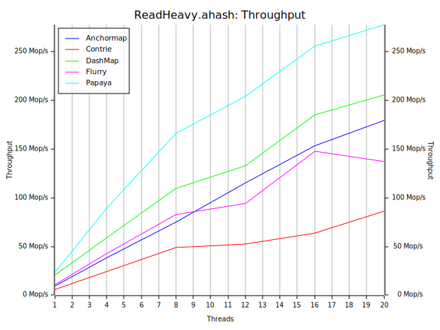
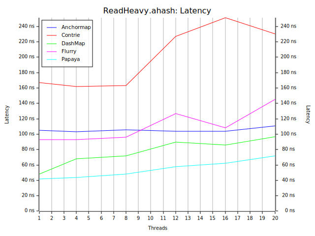
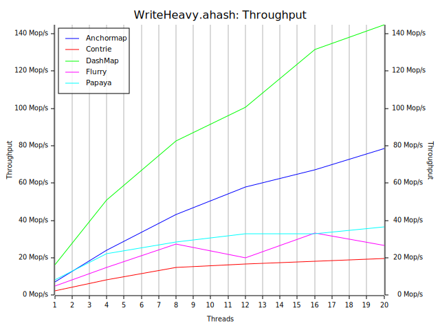
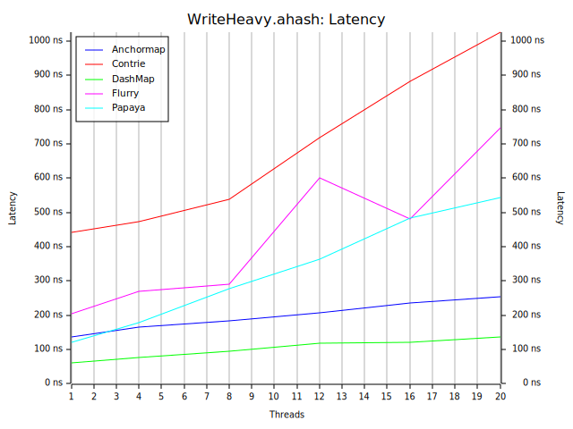
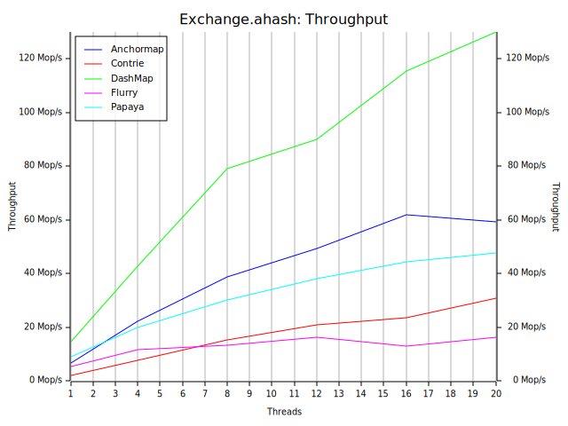
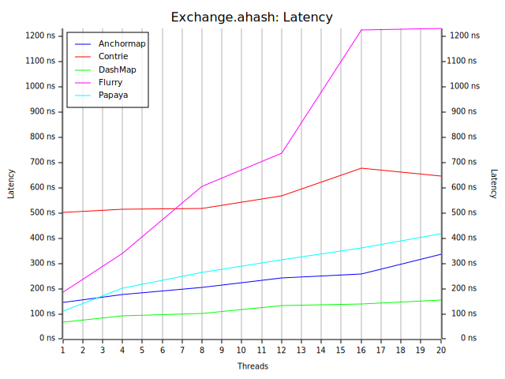
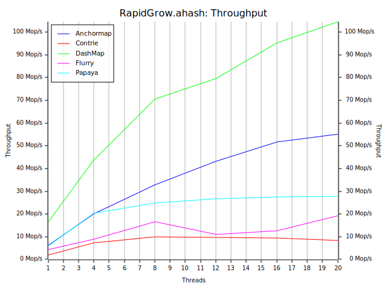
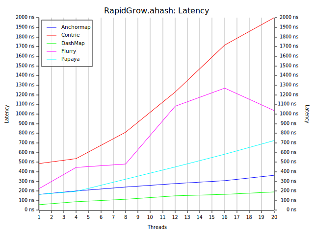

# anchormap — Benchmark Results

Benchmarks run with [conc-map-bench](https://github.com/mcrepeau/conc-map-bench) against
four concurrent map implementations: **Contrie**, **DashMap**, **Flurry**, and **Papaya**.

*Methodology:*
- 33,554,432 random keys are generated.
- Hashing algorithm is `ahash`.
- Throughput measured in million operations per second (Mop/s).

*Hardware:*
- CPU: Intel Core Ultra 7 265K
- Memory: 32GB DDR5-6400 32-40-40-84 (Corsair CMK32GX5M2B6400Z32)
- OS: Windows 10 Pro 64-bit

## Read Heavy

**Workload:**

| reads | inserts | remove | updates | upserts |
|------:|--------:|-------:|--------:|--------:|
|   98% |      1% |     1% |      0% |      0% |

**Papaya** leads decisively but **Anchormap** offers near-constant latency and still scales linearly
and reaches 179 Mop/s at 20 threads, ahead of Flurry and Contrie. Anchormap is the right choice here
when callers need to hold `&V` beyond the call site: Papaya's and DashMap's guards tie the reference
lifetime to the guard, while anchormap's references are unconditional borrows with no guard to drop. 

---

## Write Heavy

**Workload:**

| reads | inserts | remove | updates | upserts |
|------:|--------:|-------:|--------:|--------:|
|   20% |     10% |    10% |     30% |     30% |

**DashMap** leads comfortably. **Anchormap** is a clear second at max of 79 Mop/s — more than double
Papaya and more than triple Flurry. Writers acquire one of 64 per-stripe locks; because no
existing data is ever moved or rehashed, the critical section is short: claim a slot via CAS,
write the value, store the metadata byte with Release ordering, release the lock. Papaya's
epoch-based reclamation adds overhead on the write path.

---

## Exchange

**Workload:**

| reads | inserts | remove | updates | upserts |
|------:|--------:|-------:|--------:|--------:|
|   10% |     40% |    40% |     10% |      0% |

A mixed read/write workload. **DashMap** leads; **Anchormap** is second at 59 Mop/s, 50%
ahead of Papaya. Flurry degrades significantly at high thread counts due to write-side
contention.

---

## Rapid Grow

| reads | inserts | remove | updates | upserts |
|------:|--------:|-------:|--------:|--------:|
|    5% |     80% |     5% |     10% |      0% |

**DashMap** dominates; **Anchormap** is second
at 55 Mop/s, double Papaya's 30 Mop/s. Growth in anchormap appends a new segment (no rehash)
and the new segment's slots are immediately available to 64 independent stripes. Contrie's
trie structure degrades at high thread counts as nodes become hotspots.

---

## Summary

| Workload    | 🥇 1st      | 🥈 2nd         | 🥉 3rd          |
|-------------|-------------|----------------|-----------------|
| Read Heavy  | Papaya  | DashMap    | **Anchormap** |
| Write Heavy | DashMap | **Anchormap** | Papaya       |
| Exchange    | DashMap | **Anchormap** | Papaya       |
| Rapid Grow  | DashMap | **Anchormap** | Papaya       |

Anchormap is not the fastest map for any individual workload, but it is a consistent
performer: second in every write-oriented benchmark and third in read-heavy behind the two
maps with the most read-optimized internals.
